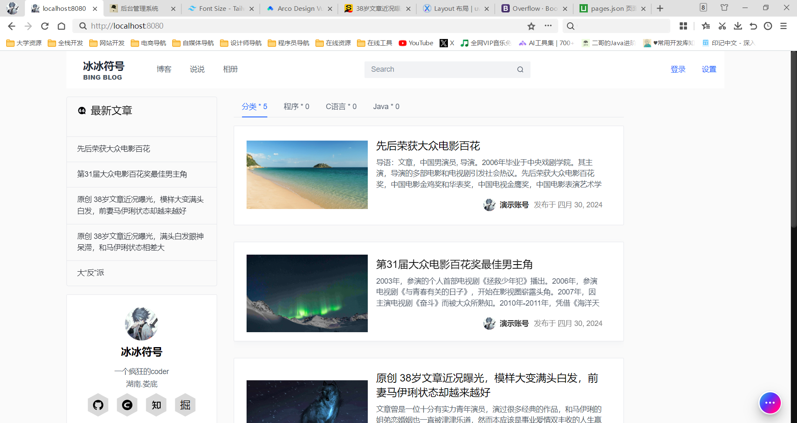

# 个人博客 - 用户端

[toc]

插件

博客主页

博客详情页

## 个人博客系统依赖

本项目使用了如下依赖进行开发

* markdown-it 文本编辑
* mitt 事件监听工具
* nprogress 头部进度条
* normalize.css 样式表重置
* tocbot 博客目录的视线
* axios 进行网络请求

### **markdown-it** [官网](https://markdown-it.docschina.org/)

Markdown编辑器

### **mitt** [官网](https://www.npmjs.com/package/mitt)

Vue3官方推荐的事件

### **nprogress** [官网](https://ricostacruz.com/nprogress/)

纳米级进度条。具有逼真的细流动画，以说服您的用户正在发生的事情!

### **normalize.css** [官网](https://necolas.github.io/normalize.css/)

一个现代的，html5就绪的替代CSS重置

### **tocbot**

博客目录插件

### **axios**

* vue-axios

### **Tailwind CSS** [官网]()

## 个人博客系统部署

1、进行网站的部署，使用Docker方式
2、使用原生的部署方式

推荐使用Docker进行部署

### Docker部署

1. 安装Docker
2. 安装Nginx
3. 进行服务的维护

### 直接部署

1. 编译代码
2. 安装Nginx
3. 上传代码至服务器
4. 配置文件
5. 启动服务

